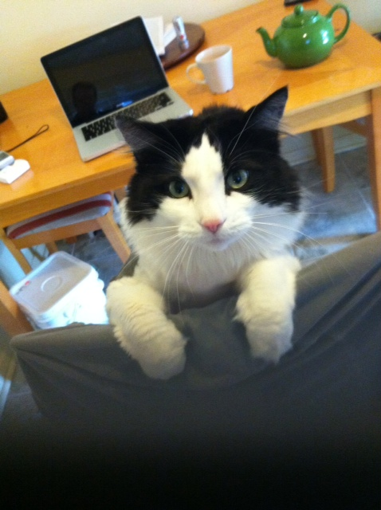

!SLIDE center
# Video break! #

!SLIDE bullets
# Next steps? #

* Add a distance sensor (e.g. SRF05)
* Code in obstacle avoidance
* Make it go reverse / forward with a button (easy!)
* Turn it into a cat toy?

!SLIDE full-page
# Dapper says Hello #

!SLIDE bullets
# So, what did I learn about Arduino? #

* It's surprisingly simple to use and add functionality to a project.
* Patience and research really helps in not blowing things up.
* Do, make, break, and repeat.

!SLIDE bullets
# Resources Used #

* Getting started with Arduino by Make. (http://goo.gl/mGn4a)
* http://luckylarry.co.uk/
* \#arduino on irc.freenode.net
* Creatron on College &amp; Spadina (http://creatroninc.com/)
