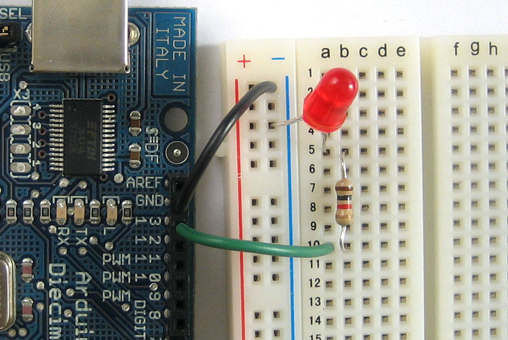

!SLIDE 
# Building a motorized robot with Arduino #

!SLIDE bullets 
# What is Arduino? #

* http://arduino.cc/
* Open-source, simple to use electronics prototyping platform.
* With $30 and one night of patience, you can get into hobbyist electronics.

!SLIDE full-page

!SLIDE center
<iframe title="YouTube video player" width="480" height="390"
src="http://www.youtube.com/embed/hDCBJ_5mRJc" frameborder="0" allowfullscreen></iframe>

!SLIDE full-page

