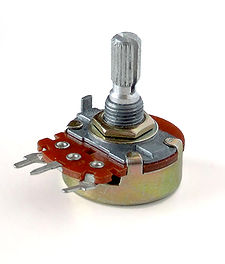
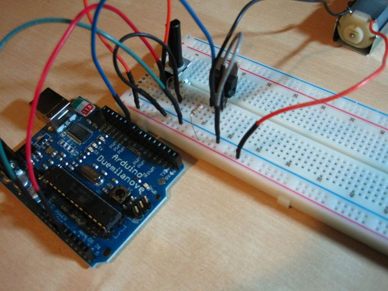

!SLIDE bullets
# First steps, powering a motor! #

* One night I learned: You can't just plug a motor into the power of an Arduino.
* Control flow of current to larger drives with MOSFET transistors!

MOSFET means "metal-oxide-semiconductor field-effect transistor". It's a special type of transistor
that operates based on field-effect principle. This means that electricity will flow through a
piece of semiconductor material (between the Drain and Source pins) when a voltage is applied to
the Gate pin. As the Gate is insulated from the rest through a layer of metal oxide, there is no
current flowing from Arduino into the MOSFET, making it very simple to interface. They are ideal
for switching on and off large loads at high frequencies. (Definition from Getting Started with Arduino by Make: Projects)

!SLIDE center
# Controlling speed #

!SLIDE bullets
# Controlling speed #

* Potentiometers provide a variable resistance which can than be read.

* Use analogRead() to get the value, map() it relative to PWM values, then analogWrite() it to a PWM pin. 

* CODE PLEASE?

!SLIDE code
# Potentiometer + Transistor #
int potpin = 0;
int mosfetPin = 9;
int val;

void setup() {
  Serial.begin(9600); // setup serial
}

void loop() {
  val = analogRead(potpin);
  val = map(val, 0, 1023, 0, 255);
  Serial.println(val);
  analogWrite(mosfetPin, val);
  delay(15);
}

!SLIDE full-page

