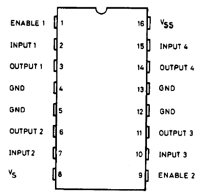

!SLIDE bullets
# Introducing H-Bridge ICs #

* Generally used to run motors in electronic circuits
* Ability for a voltage to be applied across a load in either direction
* Very simple to use!

!SLIDE center 
# L293D Diagram #

<table border="1" cellspacing="0" cellpadding="4" width="100%" bordercolor="#000000"><tbody><tr valign="top"><td width="25%" bgcolor="#000000"><strong>Pin 1</strong></td><td width="25%" bgcolor="#000000"><strong>Pin 2</strong></td><td width="25%" bgcolor="#000000"><strong>Pin 7</strong></td><td width="25%" bgcolor="#000000"><strong>Function</strong></td></tr><tr valign="top"><td width="25%" bgcolor="#e6e6ff">High</td><td width="25%" bgcolor="#e6e6ff">Low</td><td width="25%" bgcolor="#e6e6ff">High</td><td width="25%" bgcolor="#e6e6ff">Turn clockwise</td></tr><tr valign="top"><td width="25%">High</td><td width="25%">High</td><td width="25%">Low</td><td width="25%">Turn anti-clockwise</td></tr><tr valign="top"><td width="25%" bgcolor="#e6e6ff">High</td><td width="25%" bgcolor="#e6e6ff">Low</td><td width="25%" bgcolor="#e6e6ff">Low</td><td width="25%" bgcolor="#e6e6ff">Stop</td></tr><tr valign="top"><td width="25%">High</td><td width="25%">High</td><td width="25%">High</td><td width="25%">Stop</td></tr><tr valign="top"><td width="25%" bgcolor="#e6e6ff">Low</td><td width="25%" bgcolor="#e6e6ff">Not applicable</td><td width="25%" bgcolor="#e6e6ff">Not applicable</td><td width="25%" bgcolor="#e6e6ff">Stop</td></tr></tbody></table> 
!SLIDE code
# One-way motor control #
// Pin 2 on the L293D, can also accept values from a PWM pin.
int motor1Pin1 = 3;
int motor1Pin2 = 4; // pin 7 on L293D
int motorEnablePin = 9; // pin 1 on L293D
int potPin = 0;
int pot_val;

void setup() {
  Serial.begin(9600); // setup serial
    
  pinMode(motor1Pin1, OUTPUT);
  pinMode(motor1Pin2, OUTPUT);
  pinMode(motorEnablePin, OUTPUT);
  
  digitalWrite(motorEnablePin, HIGH);
}

void loop() {
   pot_val = analogRead(potPin);
   
   Serial.println(pot_val);
   pot_val = map(pot_val, 0, 1023, 0, 254);
   Serial.println(pot_val);
   
   analogWrite(motor1Pin1, pot_val);
   digitalWrite(motor1Pin2, LOW);
   
   delay(15);
}

!SLIDE center
# Adding wheels is easy with a kit! #
## No, I didn't finish this :( ##

<!--
- Introduing a motor control H-Bridge IC, the L293D.
- Possibly, adding another button that will control forward and reverse?
- Putting this all together onto a track & wheel set.
- <final code using potentiometer and maybe reverse/forward!>
- Video of it running?!
- Resources used
- Rough breakdown of costs.
-->
